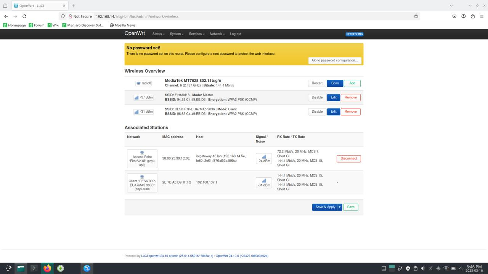

# IoT Networking Module - Week 1 & 2

## Overview

This module covers IoT networking concepts, including MQTT, network infrastructure, and intranet vs. internet-based solutions. It also includes hands-on mini-projects to set up and configure IoT networks using Manjaro Linux, IoTempower, and MQTT.

## Table of Contents

- [Week 1](#week-1)
  - [Module 2 Review and Portfolio Check](#module-2-review-and-portfolio-check)
  - [Intranet vs. Internet Research](#intranet-vs-internet-research)
  - [IoT Networking - MQTT Role-playing](#iot-networking---mqtt-role-playing)
  - [Mini Project: Network Infrastructure Game](#mini-project-network-infrastructure-game)
  - [Homework](#homework)
- [Week 2](#week-2)
  - [Netbird Demo](#netbird-demo)
  - [IoTempower Network Setup](#iotempower-network-setup)
  - [Mini Projects](#mini-projects)
- [Optional Mini Projects](#optional-mini-projects)
- [References](#references)

## Week 1

### Module 2 Review and Portfolio Check

Review and update the portfolio with key learnings from Module 2.

### Intranet vs. Internet Research

Conduct research on when an intranet-based system is preferable over an internet-based cloud system.

### IoT Networking - MQTT Role-playing

Participate in a role-playing session to understand MQTT communication in IoT networking.

### Mini Project: Network Infrastructure Game

Follow the instructions in the **LAB TUTORIAL - INFRASTRUCTURE AND GATEWAY SETUP** to complete the network infrastructure game "MQTT to the Rescue."

### Homework

- **Watch:** Adafruit video about transports and note:
  - Covered protocols.
  - One advantage and disadvantage of each.
  - Any other key observations.
- **Create a tutorial:** Write a step-by-step guide or record a video explaining how to set up an IoT network on a router with MQTT.
- **Mini Project:**
  - Set up a local cloud/intranet.
  - Install Manjaro Linux on an old laptop.
  - Configure SSH key exchange.
  - Install IoTempower on the laptop.

## Week 2

### Netbird Demo

- **Ulno’s Netbird demo** on remote access and secure connections.
- **IoTempower network setup and IoT-systems demo** by Renato.
- **USB tethering & WiFi repeater setup on Mango** for internet access.
  
  

### Mini Projects

#### IoTempower Networking

- Rename the `iot-system/demo01` folder to `firstaid`.
- Update WiFi credentials via the IoTempower menu.
- Enable USB tethering to use a phone as an internet connection.

#### FirstAid Station Emergency Button

- Set up a button on D1 Mini to publish MQTT messages when pressed/released.
- Use **PlatformIO** and **PubSubClient (Nick O’Leary)** for MQTT Pub/Sub.
- Monitor messages via MyMQTT client on a phone.

#### MQTT Listens Everywhere

- Listen to button MQTT messages using Mosquitto CLI.
- Use **IoTempower MQTT API** with wildcards to monitor all messages.
- Set up **Node-RED** to capture MQTT messages and debug.

#### Remote Access to the Gateway

- Configure **Netbird** for remote team access to the gateway laptop.

.jpeg>)

## References

- **[IoTempower Documentation](https://iotempower.readthedocs.io/en/latest/)**
- **[Mosquitto MQTT](https://mosquitto.org/)**
- **[Netbird Remote Access](https://netbird.io/)**
- **[Node-RED Guide](https://nodered.org/)**
