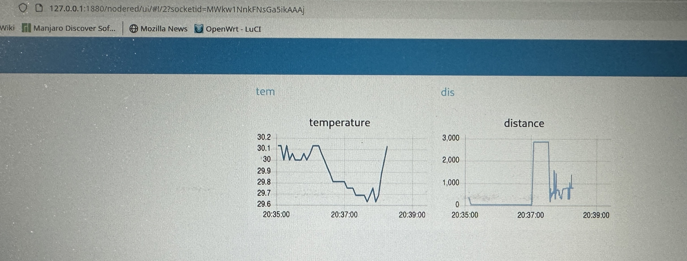

# Module 5

IOT SYSTEMS

**Session Format**

**Week 1: IoTempower as Device Management Framework**

- Mini Project: Exploring IoTempower Services and Commands

- Mini Project: First Node

- Mini Project: Second Node

- Mini Project: rebuild access control with IoTempower

- Mini Project: INFLUXDB Database


**Week 2**

- Talk about the final projects

- IoTempower usability demo

- Team finding

- Project: Liquids Measuring Project

## MiniProject: Exploring IoTempower Services and Commands

Explore available device drivers and commands by clicking on **Commands** in the IoTempower interface.

---

## 1. RFID Reader (`rfid_x`)

- **Command Purpose**: Reads RFID tags for identification, such as in access control systems.
- **Example Commands**:
  ```bash
  mfrc522(reader, D8, D0);
  ```
  - Initializes an MFRC522 RFID reader with SDA on D8 and RST on D0.
  - Publishes tag data to `node_topic/reader`, UID to `node_topic/reader/uid`, and PICC type to `node_topic/reader/picc` (supports most NFC tags).
- **Possible Use Case**: Authenticate users with RFID cards for door access or track inventory with tagged items.
- **Wiring** (Wemos D1 Mini/NodeMCU/ESP32 to MFRC522 RFID-RC522 board):
  | Wemos D1 Mini/NodeMCU/ESP32 | MFRC522 Pin | Notes |
  |-----------------------------|-------------|-------|
  | 3V3                         | 3.3V        | Power supply |
  | D8 (GPIO 5)                 | SDA         | Chip select |
  | D7 (GPIO 23)                | MOSI        | SPI data input |
  | D6 (GPIO 19)                | MISO        | SPI data output |
  | D5 (GPIO 18)                | SCK         | SPI clock |
  | D0 (GPIO 26)                | RST         | Reset pin |
  | GND                         | GND         | Common ground |
  | N/C                         | IRQ         | Not used in IoTempower |
- **Notes**:
  - Verify SPI pin assignments for your specific MCU model.
  - Use short wires to reduce noise in SPI communication.

---

## 2. PWM Control

- **Command Purpose**: Generates a PWM signal to control brightness, motor speed, or other analog outputs.
- **Example Commands**:
  ```bash
  pwm(blue, D4, 2000);
  ```
  - Sets a PWM signal on pin D4 with a duty cycle of 2000 (range typically 0–4095, depending on MCU).
  - Controls the brightness of an LED or speed of a motor.
- **Possible Use Case**: Dim an LED for ambient lighting or adjust a fan's speed based on temperature.
- **Wiring**:
  | Component | MCU Pin | Notes |
  |-----------|---------|-------|
  | LED/Motor | D4      | Connect via a current-limiting resistor (for LEDs) or a transistor/driver (for motors). |
  | GND       | GND     | Common ground with MCU. |
- **Notes**:
  - Use a MOSFET or motor driver for high-current loads.
  - Confirm the MCU’s PWM frequency compatibility with the connected device (e.g., 1 kHz for most LEDs).

---

## 3. Servo

- **Command Purpose**: Controls the angle of a servo motor for precise positioning.
- **Example Commands**:
  ```bash
  servo(m1, D3, 0, 180);
  ```
  - Initializes a servo motor on pin D3, with an angle range of 0° to 180°.
  - Publishes the current angle to `node_topic/m1`.
- **Possible Use Case**: Rotate a camera for surveillance, open a pet feeder flap, or control a robotic arm.
- **Wiring**:
  | Servo Pin | MCU Pin | Notes |
  |-----------|---------|-------|
  | Signal    | D3      | PWM-capable GPIO pin. |
  | VCC       | 5V      | Use external 5V power for high-torque servos. |
  | GND       | GND     | Shared ground with MCU and external power. |
- **Notes**:
  - High-torque servos require an external power supply with a common ground.
  - Check the servo’s supported angle range (some may allow <0° or >180°).

---

## 4. Ultrasonic Distance (`hcsr04/rcwl-1601`)

- **Command Purpose**: Measures distance using an ultrasonic sensor (HC-SR04 or RCWL-1601).
- **Example Commands**:
  ```bash
  hcsr04(distance, D4, D5).with_precision(10);
  ```
  - Configures an HC-SR04 sensor with TRIG on D4 and ECHO on D5.
  - Publishes distance (in cm) to `node_topic/distance`, averaging 10 readings for precision.
- **Possible Use Case**: Trigger a light when someone approaches, measure liquid levels, or enable obstacle avoidance in robotics.
- **Wiring**:
  | Sensor Pin | MCU Pin | Notes |
  |------------|---------|-------|
  | VCC        | 5V      | 3.3V may work for some sensors; check specs. |
  | TRIG       | D4      | Trigger pulse input. |
  | ECHO       | D5      | Echo pulse output (ensure 5V tolerance). |
  | GND        | GND     | Common ground. |
- **Notes**:
  - Use a voltage divider or level shifter if ECHO pin outputs 5V and the MCU is 3.3V.
  - Ensure clear line-of-sight for accurate measurements (range: ~2 cm to 4 m).

---

## 5. RGB LED (`rgbled_x`)

- **Command Purpose**: Controls the color of an RGB LED by setting red, green, and blue intensities.
- **Example Commands**:
  ```bash
  rgbled_x set 255 0 0  # Red
  rgbled_x set 0 255 0  # Green
  rgbled_x set 0 0 255  # Blue
  ```
  - Sets RGB values (0–255) for each color channel.
  - Updates LED color immediately, published to `node_topic/rgbled_x`.
- **Possible Use Case**: Provide visual feedback (e.g., red for alerts, green for success, blue for idle).
- **Wiring**:
  | LED Pin | MCU Pin | Notes |
  |---------|---------|-------|
  | R       | D1      | Connect via 220–470Ω resistor. |
  | G       | D2      | Connect via 220–470Ω resistor. |
  | B       | D3      | Connect via 220–470Ω resistor. |
  | Common  | GND/5V  | Common cathode (GND) or anode (5V), per LED type. |
- **Notes**:
  - Use PWM-capable pins for smooth color transitions.
  - Verify if the LED is common cathode or common anode to connect the common pin correctly.

---

## Code Snippets

[Load Cell](<code/Load Cell>)

[Distance Sensor](<code/Distance Sensor>)

[LED](code/LED)

[LED Button](<code/LED Button>)

[NODE 2](<code/NODE 2>)

[UID](code/UID)


## Lab Pictures





